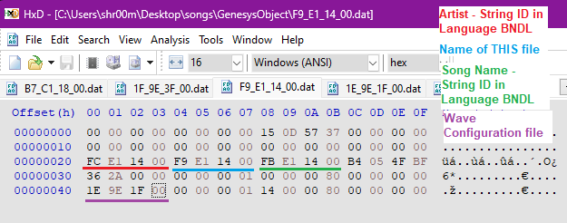
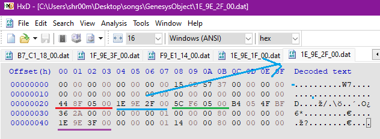
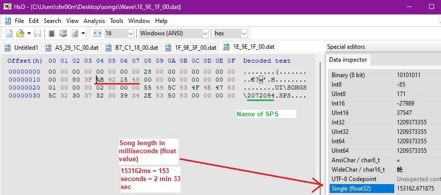
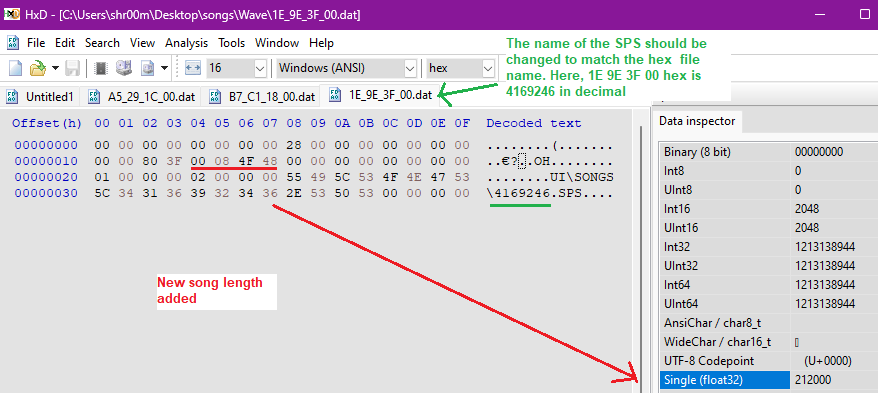
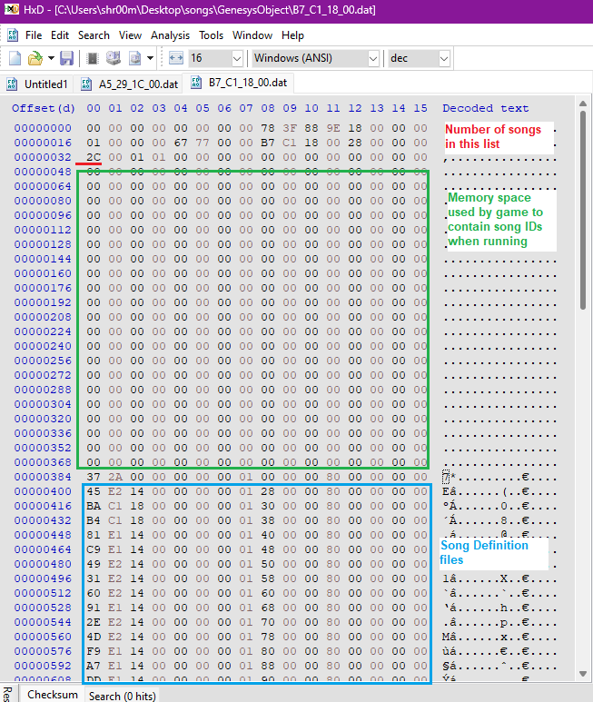
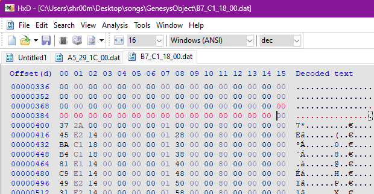
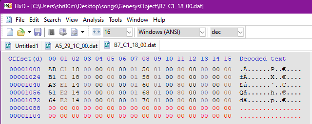
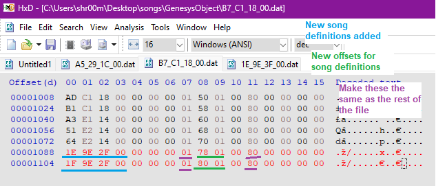

# MW12 - Adding new songs

This tutorial is for adding 2 new songs to as an example.

### 1\. Unpack SONGS.BNDL and decide on file names

Each song requires three files, a “Song Definition”, a “Wave Configuration” and the SPS file of the song itself. So you have to create those. Best to use an existing song’s files as a template.

* To create a “Song Definition” file I used the existing **F9\_E1\_14\_00.dat** in GenesysObject / 15\_00\_00\_00 folder.
* To create a “Wave Configuration” file I used the existing **1E\_9E\_1F\_00.dat** in the Wave / 81\_00\_00\_00 folder.

Because these are gonna be new songs, each file needs to have a UNIQUE name that is not used anywhere else in the entire game. So you need to determine what names to use. I think you can be reasonably safe following a pattern that the existing files use.

I came up with:
* **1E\_9E\_2F\_00** and **1F\_9E\_2F\_00** for the “Song Definitions”
* **1E\_9E\_3F\_00** and **1F\_9E\_3F\_00** for the “Wave Configurations”

_Tip: Use Cheat Engine with the game running to search for the names you want to use. If they exist, try something else._

### 2\. Creating a Song Definition

* Open the “Song Definition” template (in my case **F9\_E1\_14\_00.dat**)

* Update the part in blue to the new “song definition” file
* Update the part in purple to the new “wave configuration” file.
* Then rename the file the same as the part in blue. Do I have to mention that this renamed file should be saved separately?
* The Red part and Green part are optional, you need to select another [string ID](https://hrj.leibur.eu/PUBLIC/UPLOADED/New%20folder/string_id.txt) to change this correctly.

Here’s what it looks like after the changes:

### 3\. Creating a Wave Configuration

* Open the “Wave Configuration” template (in my case **1E\_9E\_1F\_00.dat**):

* The length of the song in milliseconds can be updated (idk if it actually needs to be done), and the name of the SPS you’ll use.
* The SPS name should be the SAME as the NEW “Wave Configuration” file name, but converted to decimal (little endian).
* My Wave Config file is now called **1E 9E 3F 00** and in decimal (little endian) that is 4169426. So my SPS is called **4169426.SPS**

Here is what it looks like after I made the changes:

### 4\. Adding to the main song lists

* In the GenesysObject / 15\_00\_00\_00 folder find the files named **A5\_29\_1C\_00.dat** and **B7\_C1\_18\_00.dat**
* Open those 2 files in hex editor. Here’s the default layout:

* The red highlighted section should be updated from 2A (42 songs) to 2C (44 songs)
* An extra line of 16 bytes should be added after offset 368. This is extra “memory space” to hold the song ID’s when the game is running. Each song requires 8 bytes.
* To do that in HxD put the cursor at the END of the line at offset 368, click **Edit** > **Insert Bytes**.
* Select **Decimal** and enter **16** then click **OK**. (if you were adding more than 2 songs, you would add more multiples of 8 bytes as needed)

* So it should look like this after:

* Scroll to the end of the file and insert two more lines of 16 bytes so it looks like this:

* Now the two new Song Definitions need to be added, in the blank space you just created at the end - one line for each.

* In the above screenshot are:
* Blue part - the song definitions.
* Purple parts - make them the same as everything else. Either 01 or 80 as shown.
* Green parts - These are offsets, pointing to a particular spot in the new “memory space” you created near the top of the file. They follow a simple pattern.
* For more songs the offsets would be 78 01, 80 01, 88 01, 90 01, 98 01, A0 01, A8 01, etc.
* Do those changes to both files (**A5 29 1C 00.dat** and **B7 C1 18 00.dat**)

Now all you have to do is generate the new SPS files, and repack the new Wave Configuration and Song Definition files to SONGS.BNDL by editing the IDs.BIN as usual. Don’t forget to put the new SPS files in the SONGS folder too.
